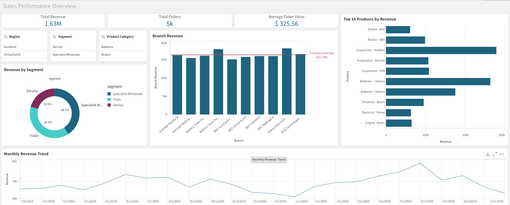

# NZ Automotive Aftermarket — Data Analysis Portfolio

An end-to-end data analysis portfolio project simulating sales analytics
for a fictional New Zealand automotive parts distributor, modelled on
real NZ automotive aftermarket industry patterns.

## Dashboard Preview

## Project Overview

This project builds a complete data analysis pipeline covering:
- Synthetic data generation modelled on real NZ automotive aftermarket
  business structure and pricing patterns
- Star schema database design (SQLite)
- SQL business analysis across revenue, segments, and seasonality
- Interactive dashboard built in Qlik Cloud Analytics - https://2to3u3wx24lkakm.ap.qlikcloud.com/sense/app/1948f705-427d-4826-9492-35bd4c56facd

## Business Context

The fictional distributor operates across three segments common in the
NZ automotive aftermarket industry:

- **Trade** — supplying independent workshops and chain mechanics
- **Specialist Wholesale** — steering, suspension, diesel, and auto
  electrical parts distribution
- **Service** — battery and auto electrical service centres

Branches are distributed across Auckland, Wellington, Christchurch,
and Hamilton, weighted by real NZ regional population distribution.

## Key Findings

- Specialist Wholesale generated 40.7% of total revenue from just 4
  branches, outperforming Trade despite equal branch count
- Battery revenue more than doubled in NZ winter months — peaking in
  August at $165k monthly revenue compared to $113k in December,
  driven by cold-weather battery failure patterns
- Filter revenue peaked in summer (Jan–Feb) aligned with increased
  service intervals during the driving season — the inverse of the
  battery pattern
- Diesel and specialist parts branches ranked highest in revenue despite
  similar order volumes to trade branches — driven by significantly
  higher unit prices per transaction
- Suspension - Pedders and Batteries - Century were the top two revenue
  generating product-brand combinations, contributing ~$285k and ~$265k
  respectively
- BNT Auckland Central ranked below the $162.78k company average
  despite being the flagship trade branch — suggesting a potential
  customer mix or pricing issue worth investigating
- Average order value across all branches was $325.56 — consistent with
  a B2B trade customer base rather than retail

## Dashboard

Built in Qlik Cloud Analytics with the following components:

- **KPI cards** — Total Revenue ($1.63M), Total Orders (5k), Average
  Order Value ($325.56)
- **Branch Revenue vs Company Average** — bar chart with $162.78k
  benchmark reference line identifying over and underperforming branches
- **Top 10 Products by Revenue** — horizontal bar chart ranked by
  Sum(revenue) using Qlik dimension limitation
- **Revenue by Segment** — donut chart showing Trade/Wholesale/Service
  split
- **Monthly Revenue Trend** — line chart showing seasonal patterns
  across 24 months
- **Interactive filter panes** — Region, Segment, Product Category
  filters driving the full associative data model

## Project Structure
automotive-nz-analysis/
├── data/              # CSV files (auto-generated by notebooks)
├── notebook/          # Jupyter notebooks
│   ├── 01_data_generation.ipynb
│   └── 02_sql_analysis.ipynb
├── sql/               # SQL query files
│   ├── 01_branch_revenue.sql
│   ├── 02_segment_revenue.sql
│   └── 03_seasonal_trends.sql
├── dashboard/         # Qlik files 
├── docs/              # Data dictionary
└── README.md

## How to Run

1. Clone the repository
2. Create a virtual environment:
   `python3 -m venv venv`
3. Activate it:
   `source venv/bin/activate`
4. Install dependencies:
   `pip install pandas faker numpy jupyter sqlalchemy`
5. Run `01_data_generation.ipynb` to generate all CSV files
6. Run `02_sql_analysis.ipynb` to load the database and run queries
7. Load the 4 CSV files from the data folder into Qlik Cloud Analytics

## Data Model

Star schema with orders as the central fact table:

branches ←──┐
products ←──┤── orders (5,000 rows, 2024–2025)
customers ←─┘

### Tables

| Table | Rows | Description |
|---|---|---|
| branches | 10 | Branch name, brand, region, segment |
| products | 120 | Part number, category, brand, cost, RRP |
| customers | 200 | Customer type, region, join date |
| orders | 5,000 | Order date, branch, customer, product, revenue |

## SQL Analyses Completed

| Query | Business Question | Key Finding |
|---|---|---|
| 01_branch_revenue | Which branches generate the most revenue? | Diesel Distributors Auckland ranked #1 at $180k |
| 02_segment_revenue | How does revenue break down by business segment? | Specialist Wholesale leads at 40.7% |
| 03_seasonal_trends | Which months drive peak demand by product category? | Which months drive peak demand by category? | Battery revenue peaks in August, filters peak in January |

## Tools and Technologies

- Python 3 (pandas, numpy, Faker, SQLAlchemy)
- SQLite
- Jupyter Notebook
- Qlik Cloud Analytics

## Data Limitations

- Dataset is fully synthetic — generated to reflect realistic NZ
  automotive aftermarket business patterns, not real company data
- Branch order volumes are evenly distributed across regions; real
  data would show stronger Auckland concentration
- Pricing uses randomised cost-plus margins within realistic ranges
  per product category
- Date range extends slightly beyond the intended 2024–2025 window
  due to Faker date generation behaviour — noted and documented
- Qlik synthetic key conflicts on region and brand fields were resolved
  by renaming fields in the load script using AS aliases

## Author

Savith Dissanayakage
Master of Information Technology (Distinction)
[LinkedIn](https://www.linkedin.com/in/savithdissanayake)
[GitHub](https://github.com/saviya98)
